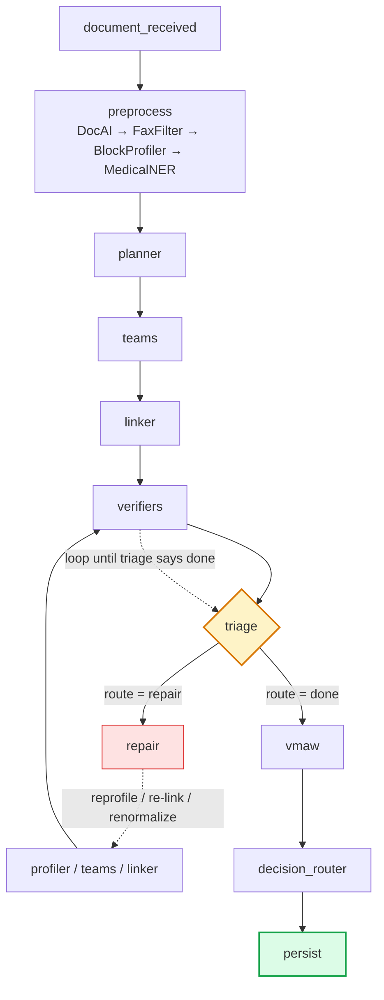

# Project Architecture — Agentic Genomic / Pathology Extraction

> Knowledge-transfer reference — read this to understand the code and the flow.

---

**Who this is for.** An engineer joining the project who needs to
understand, end to end, what the system does, how a document moves
through it, how the LangGraph state machine is built, what every
component does, and where to change things. It assumes general
familiarity with Python and LLMs but explains every project-specific
concept.

**Companion documents.** PIPELINE_REFERENCE.md (per-node + config
change-playbooks) and AGENTS.md (the agent-vs-workflow classification).
This document is the umbrella that ties them together.

# Contents

1. What the system does
2. The 60-second mental model
3. Repository map — where things live
4. The execution lifecycle — entry to exit
5. How the LangGraph is constructed
6. The eleven nodes — purpose and mechanism
7. Agents, single calls, and rules
8. The configuration system
9. The verification suite — how each check works
10. The core infrastructure (core/)
11. The agent trace — the audit spine
12. The SME review system
13. Artifacts written per run
14. Extending the system
15. Testing — the gate suite
16. The evaluation module — post-extraction grading
17. Glossary
# 1. What the system does

The system reads a clinical PDF (a genomic / molecular-pathology report)
and produces a **structured, schema-conformant, evidence-grounded
extraction** of its clinically meaningful content — patient metadata,
gene variants, molecular biomarkers, and the tested-gene panel — along
with a complete audit trail of how every value was obtained, and a
prioritized queue of anything a human needs to review.

**The hard problem.** Clinical PDFs are messy: OCR noise, fax artifacts,
tables split across pages, the same gene mentioned three different ways,
addenda that amend earlier findings. A naive "feed the PDF to an LLM and
ask for JSON" approach fails on recall (misses findings), precision
(hallucinates), grounding (can't prove where a value came from), and
auditability (a black box no clinician will trust).

**The approach.** A multi-stage pipeline that combines deterministic
rules, single-purpose LLM calls, and one genuinely agentic extractor — each used only where it is the cheapest correct tool — wired together
as a self-correcting LangGraph state machine. Everything an LLM produces
is checked by a deterministic verifier; anything that fails is
auto-repaired where possible and escalated to a human only when it
genuinely needs judgment.

  ----------------------------------------------------------------------------------------------------------------------------------------------------------------------------------------------------------------------------------------------------------------------------------------------
## **One-sentence summary.** A self-correcting graph that extracts structured clinical data with recall-first LLM agents, validates everything with deterministic checks, auto-repairs what it can, and escalates only the genuine residue — with a full per-field audit trail at every step.

# 2. The 60-second mental model

A document flows through the nodes in a straight line until triage,
which either finishes the document or kicks off a correction loop (the
ping-back):

**The ping-back loop.** triage → repair → linker → verifiers → triage.
After repair fixes something, the linker re-assembles, the verifiers
re-check, and triage decides again — repeating until no fixable
defects remain (or the repair budget / recur-guard stops it). This is
what makes the graph self-correcting rather than a one-shot pipeline.

  --------------------------------------------------------------------------------------------------------------------------------------------------------------------------------------------------------------------------------------------------------------------------------------------------------------------------------------------------------------------------------------------------------------------------------------------------------------------------------------------------------------------------------------------------------------------
## **How far back does the repair reach?** The GRAPH edge after repair is always repair → linker. But the WORK inside the repair node reaches further back than the linker: **reprofile_block** re-runs the BlockProfiler on a misrouted block (a preprocess-stage agent) and then re-extracts; **re_extract_team** re-runs the team's Extractor/Auditor/Arbiter. So although the graph only loops back to the linker, the correction effectively reaches back as far as the BlockProfiler — re-profile a block → re-extract → re-link → re-verify → re-triage.

**Read it as four stages:** (1) PREPARE the document into
pages/blocks/candidates (preprocess); (2) EXTRACT each schema section
with a team of agents (planner + teams); (3) ASSEMBLE + VERIFY the whole
envelope (linker + verifiers); (4) CORRECT — triage routes each defect
either back into the ping-back loop (repair, which can re-profile a
block, re-extract a team, renormalize a field, etc.) or, once settled,
forward to deep-resolution (vmaw), a final verdict (decision_router),
and disk (persist).

# 3. Repository map — where things live

The codebase is organized by responsibility, not by phase. The
directories you'll touch most:

  **Directory**    **What's in it**
  ---------------- -----------------------------------------------------------------------------------------------------------------------------------------------------------------------------------
  pipeline/        The graph itself. runner.py (entry), graph_selfcorrecting.py (the state machine), graph_linear.py (team/linker/verifier nodes), triage.py, repair.py, vmaw.py, agent_trace.py.
  agents/          The reasoning units: extractor.py (the agent), coverage_auditor.py, arbiter.py, linker.py, link_binding_verifier.py, adjudicators.py, planner.py, base.py.
  preprocess/      Document preparation: docai_parser.py, fax_header_filter.py, block_profiler.py, medical_ner.py, hgvs_validate.py, hgnc_resolver.py, normalizers.
  verification/    The 8 deterministic verifiers (schema, coverage, link_consistency, evidence, recall_floor, attribution, normalization, hgvs_validity).
  decision/        decision_router.py — the final accept / partial / sme_flag verdict.
  core/            Cross-cutting infrastructure: schema_loader.py, prompt_renderer.py, trace_recorder.py, tool_registry.py, state.py, persistence.py, checkpointer.py.
  config/          All behavior-driving configuration: schemas/, prompts/, teams_v4.yaml, section_layout.yaml, link_registry_v4.yaml, dedup_policy.yaml, ner_mapping.yaml.
  ui/phase1/       The Streamlit review UI: field_trace.py, field_view.py, evidence.py, sme_decisions.py, views/.
  scripts/gates/   The deterministic regression suite — one gate per milestone, pure-function asserts that run offline.
  docs/            This document, PIPELINE_REFERENCE.md, AGENTS.md, and the architecture set.

# 4. The execution lifecycle — entry to exit

Everything starts with make run-local PDF=\<path\> PHASE=4, which runs
python -m pipeline.runner. The runner does five things:

1.  **Resolve the PDF** — local path or gs:// URI; reads the bytes
    into memory.

2.  **Load configs** — the v4 schema into a SchemaLoader (builds
    Pydantic models at runtime), the Jinja prompt environment, and the
    YAML configs (teams, layout, links, dedup, NER).

3.  **Build the graph** — calls
    graph_selfcorrecting.build_selfcorrecting_graph(deps), which
    assembles and compiles the LangGraph state machine.

4.  **Seed the state** — {doc_id, pipeline_version:"v4",
    raw_pdf_bytes, agent_trace:[]}.

5.  **Invoke** — await graph.ainvoke(seed, config={recursion_limit:
    60}). The graph executes the nodes; each node writes artifacts to
    disk. The runner returns a RunResult with the verdict, latency, and
    cost.

# 5. How the LangGraph is constructed

This is the heart of the system. The graph is a **LangGraph StateGraph** — a directed graph of nodes that each read a shared state object and
return a partial update. Construction happens in
pipeline/graph_selfcorrecting.py:build_selfcorrecting_graph().

## 5.1 The shared state object

Every node reads and writes one TypedDict, PipelineState (in
core/state.py). It has channels for every stage: doc_profile,
parser_hypothesis, section_outputs, team_results, links,
verifier_scorecards, repair_requests, escalation_queue, agent_trace,
verdict, and more.

  -----------------------------------------------------------------------------------------------------------------------------------------------------------------------------------------------------------------------------------------------------------------------------------------------------------------------------------------------------------------------------------------------------------------------------------------------------------------------------------------------------------------------------------------------
## **Critical rule — declare or drop.** LangGraph only propagates state keys that are DECLARED on PipelineState. An undeclared key a node returns is silently dropped between nodes. This caused a real bug (the "empty extraction" bug) where the repair-cycle channels vanished. Every channel the triage→repair→linker→verifiers→triage cycle threads — repair_budget_used, repair_requests, defect_signatures_seen, block_reads, repair_log — must be declared. If you add cross-node state, declare it on PipelineState first.

## 5.2 How state deltas merge

LangGraph's default channel behavior is **last-value-wins
(overwrite)**, not append — there are no reducer annotations on the
channels. This has one important consequence for the agent_trace
channel, which must ACCUMULATE across all nodes:

Each node that records to the trace reads the current list, appends its
records, and returns the WHOLE new list — via
core/trace_recorder.py:extend_trace():

+----------------------------------------------------------------------+
| # every node does this — read, append, return the full list       |
|                                                                      |
| return {"agent_trace": extend_trace(state.get("agent_trace"), |
| rec1, rec2, \...)}                                                   |
|                                                                      |
| # extend_trace assigns a monotonic \`step\` to each new record and |
| returns                                                              |
|                                                                      |
| # a fresh list. Because the channel overwrites, returning the full  |
| list                                                                 |
|                                                                      |
| # is how accumulation works without a reducer.                      |
+----------------------------------------------------------------------+

## 5.3 The nodes and edges

Construction is explicit — add each node, then wire the edges:

+----------------------------------------------------------------------+
| g = StateGraph(PipelineState)                                        |
|                                                                      |
| g.add_node("document_received", _document_received_v3_node)  |
|                                                                      |
| g.add_node("preprocess",                                          |
| make_preprocess_node(deps.preprocess_deps))                       |
|                                                                      |
| g.add_node("planner", _make_planner_node(\...))                |
|                                                                      |
| g.add_node("teams", _make_teams_node(teams=deps.teams))        |
|                                                                      |
| g.add_node("linker", _make_linker_node(linker=deps.linker,     |
| \...))                                                               |
|                                                                      |
| g.add_node("verifiers",                                           |
| _make_selfcorrecting_verifier_node(\...))                        |
|                                                                      |
| g.add_node("triage", make_triage_node(agent=triage_agent))     |
|                                                                      |
| g.add_node("repair",                                              |
| make_repair_node(executor=repair_executor))                       |
|                                                                      |
| g.add_node("vmaw", make_vmaw_node(agent=vmaw_agent))           |
|                                                                      |
| g.add_node("decision_router",                                    |
| make_decision_router_v3_node(\...))                              |
|                                                                      |
| g.add_node("persist",                                             |
| _make_selfcorrecting_persist_node(\...))                         |
|                                                                      |
| g.set_entry_point("document_received")                          |
|                                                                      |
| g.add_edge("document_received", "preprocess")                  |
|                                                                      |
| g.add_edge("preprocess", "planner")                             |
|                                                                      |
| g.add_edge("planner", "teams")                                  |
|                                                                      |
| g.add_edge("teams", "linker")                                   |
|                                                                      |
| g.add_edge("linker", "verifiers")                               |
|                                                                      |
| g.add_edge("verifiers", "triage")                               |
|                                                                      |
| # THE LOOP: triage routes to repair (fixable + budget) or vmaw      |
| (settled)                                                            |
|                                                                      |
| g.add_conditional_edges("triage", triage_route,                 |
|                                                                      |
| {"repair": "repair", "done": "vmaw"})                        |
|                                                                      |
| g.add_edge("repair", "linker") # re-link → re-verify →         |
| re-triage                                                            |
|                                                                      |
| g.add_edge("vmaw", "decision_router")                          |
|                                                                      |
| g.add_edge("decision_router", "persist")                       |
|                                                                      |
| g.add_edge("persist", END)                                        |
|                                                                      |
| compiled = g.compile(checkpointer=checkpointer)                      |
+----------------------------------------------------------------------+

**The one decision point.** Every edge is fixed EXCEPT triage, which
uses add_conditional_edges. The function triage_route(state) returns
either "repair" or "done", and the graph follows the matching edge.
"repair" loops back to the linker; "done" exits the loop to VMAW.
This conditional edge is what makes the graph self-correcting rather
than linear.

## 5.4 The repair loop and why it terminates

The cycle triage → repair → linker → verifiers → triage could spin
forever if defects keep re-firing. Three guarantees stop it:

-   **Per-team repair cap** (default 1) — each team gets at most one
    re-extract per run.

-   **Global budget** = n_teams × factor — once spent, all remaining
    defects escalate instead of repairing. Threaded through the
    repair_budget_used channel.

-   **Recur-guard** — if the same defect signature (kind, ref,
    section) is seen twice in a row, it force-escalates (the repair
    isn't working). Threaded through defect_signatures_seen.

-   **Hard backstop** — LangGraph's recursion_limit=60 is the final
    safety net if all else fails.

## 5.5 The checkpointer

The graph compiles with a MemorySaver checkpointer (Phase 1 default,
from core/checkpointer.py). It snapshots state between nodes so a run
can be resumed. Phase 4 swaps in a Firestore-backed checkpointer when
SME interrupt/resume lands — the factory build_checkpointer() is the
single swap point, no graph change needed.

# 6. The eleven nodes — purpose and mechanism

Each node below states WHY it exists (the problem it solves), HOW it
works internally (the mechanism), and what it reads and writes. This is
the heart of understanding the system — the graph just sequences
these.

## 6.1 document_received

**Purpose.** A guard rail. Downstream nodes assume certain state keys
exist; this node fails fast on a malformed invocation and seeds the
empty scaffolding so no later node hits a missing-key error.

**Mechanism.** Checks the seed has the required fields (doc_id, pdf
source), asserts pipeline_version == "v4", and returns initial empty
channels (team_outputs={}, verifier_scorecards=[], latency_ms=0).
No LLM, no trace.

## 6.2 preprocess — turn a PDF into reasoning-ready structure

**Purpose.** LLMs reason over text, not pixels. This node converts the
raw PDF into the structured substrate every later stage needs: per-page
text, layout blocks with bounding boxes, block roles, and a
candidate-entity list. It runs four sub-agents in sequence, each solving
one sub-problem.

### DocAIParser — PDF → pages, blocks, boxes

**Why.** We need not just the text but WHERE each piece sits on the page — bounding boxes drive the UI highlighting and the per-block
provenance citations. **How.** POSTs the PDF bytes to Google Document
AI's Layout Parser, which returns pages, layout blocks (paragraphs,
table cells, headers) each with a bounding box and reading-order index.
A diagnostic logs how many blocks actually carried boxes (catches
processor-version regressions). Cross-page tables are stitched so a
result row split across a page break stays one logical block. Writes
docai_raw.json, pages.json, blocks.json, word_geometry.json,
source.pdf.

### FaxHeaderFilter — strip transport noise

**Why.** Faxed reports carry banner pages, TO/FROM headers, and
page-count footers that are not clinical content; left in, they pollute
NER and waste extractor attention. **How.** Deterministic heuristics
(regex + position) flag matching blocks with text_role =
fax_transport_noise. Flagged blocks are hidden from downstream prompts
but kept in state (the extractor can still inspect them via a tool if it
must). Pure rules — the patterns are stable and you want 100%
reproducibility.

### BlockProfiler — label every block's role + section

**Why.** Two later stages need to know what each block IS: the
recall-floor verifier (a block roled "results_table" that produced no
extraction is a loud miss) and the per-team block index (the extractor
is shown which blocks belong to its section). A regex cannot tell a
methodology paragraph from a results paragraph — it needs reading
comprehension. **How.** A single Gemini Flash call (batched 300 blocks
per call, ≤3 concurrent) classifies each block into one of \~28 roles
(report_title, panel_or_test_name, methodology, results_table,
interpretation, clinical_significance, final_diagnosis, addendum,
electronic_signature, page_header, ...) and a list of target-umbrella
hints (which schema sections the block likely feeds). Writes
block_profiles.json. It's a single call, not an agent — all the
block text is already in the prompt; there's nothing to look up.

### MedicalNER — propose candidate entities (the recall floor)

**Why.** Each team's extractor needs a RECALL FLOOR — a seed list of
entities it must capture or exceed — so a missed gene is caught.
**How.** Three SciSpaCy / spaCy models (en_ner_bionlp13cg_md for
genes/proteins, en_ner_bc5cdr_md for chemicals/diseases,
en_core_web_sm for people/dates/orgs) run over each block to extract
raw entity spans. Then a DETERMINISTIC post-processor
(config/ner_mapping.yaml) routes them in 6 steps: (1) drop entities in
noise-role blocks; (2) drop stoplist false-positives; (3) look up the
label → allowed sections; (4) intersect with the block's umbrella hints
(empty → fall back to allowed, confidence 0.6; non-empty → 0.9); (5)
group occurrences by (surface, section); (6) for metadata, assign a
target-field hint. Writes parser_hypothesis.json. The post-processor is
deterministic (it replaced an earlier LLM version) because the routing
is fully specifiable.

Emits 4 preprocess trace records (one per sub-agent).

## 6.3 planner — decide which teams run

**Purpose.** Not every document has every section; running a team whose
section is absent wastes an LLM call. The planner prunes the team set.
**Mechanism.** Deterministic. Reads the teams config (enabled flags — v4 disables significant_findings + clinical_information) and the block
section-hints; a team with no supporting hint and no config requirement
can be skipped. Returns active_team_keys + a per-team rationale. Emits
one planning record. No LLM — the decision is config + set logic with
an exact answer.

## 6.4 teams — the extraction heavy-lifter

**Purpose.** Produce a validated extraction of each schema section,
recall-first but precision-checked. This is where the real clinical
content is pulled out. **Mechanism.** Every active team runs in parallel
(asyncio.gather). A team is a 4-agent flow:

-   **Extractor** (the only true agent) — a ReAct loop that reads the
    routed blocks + page text, calls tools, and emits the section JSON.
    Details below.

-   **CoverageAuditor** — a single Gemini call that re-reads,
    comparing the extractor output against the NER candidates to flag
    missed or spurious fields and raise a gap_signal.

-   **Arbiter** (fires only on a gap) — a single Gemini Flash call
    deciding ACCEPT_EXTRACTOR (auditor was wrong), RE_EXTRACT (try
    again with focused hints), or INVOKE_VMAW (escalate).

-   **Extractor (re-extract)** (fires only if Arbiter said RE_EXTRACT)
    — the same agent with the hints appended.

### The Extractor's ReAct loop (the mechanism that matters most)

Capped at **MAX_ITERATIONS = 12**. Each iteration: send the message
history to Gemini (with tools bound); if it returns tool calls, execute
them and append the results; if it returns a Final Answer, parse +
validate. Key safeguards:

-   **Force-final on the last 2 iterations** — tools are dropped and
    JSON is demanded, so a tool-happy model can't burn the whole budget
    without finalizing.

-   **Section-wrap unwrap** — if the model wraps its output under the
    section name ({"Genomic_Variant_umbrella": {...}}), it's
    unwrapped once before validation.

-   **Scalar coercion** — known type-tics are fixed (page_number:
    [1] → 1) per section_layout.scalar_keys.

-   **Validate + retry** — the payload is Pydantic-validated against
    the section; on failure the raw content is dumped to
    local_runs/_extractor_debug/ and a correction message is injected
    for one more try. Two failures → AgentError.

Writes section_outputs + team_results. Emits one trace record per
agent, including the Extractor's full ReAct sub-steps (each thought,
tool call, tool result) and its \<reasoning\> block when present.

## 6.5 linker — assemble one envelope + find relationships

**Purpose.** Each team produced its section in isolation. The linker
stitches them into one document envelope, discovers cross-section
relationships (a variant on a tested panel, a result for a tested gene,
an addendum amending a finding), and reconciles the same entity
appearing in two sections. **Mechanism — five steps:**

6.  **Assemble.** Walk section_outputs and build the envelope, driven
    by section_layout.yaml (record_array, count fields, empty
    placeholders) so the code is generic across sections.

7.  **Gene-key seed links.** For each registered link type
    (link_registry_v4.yaml), walk both endpoint sections and match
    records by HGNC-canonical gene key (so HER2 == ERBB2).
    Deterministic.

8.  **Contextual links.** An optional LLM adjudicator proposes links a
    rule can't (e.g. "the above variant" → a specific finding). Each
    proposal then passes 4 deterministic validation checks: type ∈
    registry, endpoint sections match the registered pair, both refs
    resolve, evidence cited + confidence ≥ floor. Rejected proposals are
    recorded as dropped_contextual_links.

9.  **Dedup — two rules, one config.** dedup_policy.yaml declares
    both kinds. **(a) Cross-section dedup:** when the same gene appears
    in two sections, the policy names the owner and drops the duplicate
    from the lower-priority section (e.g. a sequence variant belongs to
    Genomic_Variant_umbrella, not the biomarker section). **(b)
    Intra-section dedup (generic, field-agnostic):** when the same
    entity appears multiple times INSIDE one section — e.g. KRAS p.G12D
    restated on two pages with different VAFs — a `within_section`
    rule with `identity_keys: [gene_key, amino_acid_change]` reconciles
    the duplicates. If all non-identity fields agree, keep the first
    and drop the rest. If any field differs, emit a
    `variant_superseded_by` link from loser→winner (winner = later
    page). Implemented in `agents/linker._apply_intra_section_dedup`
    with `_canon_change` and `_HGVS_PREFIX_RE` for HGVS-prefix-tolerant
    identity comparison (`p.G12D` matches `G12D`).

10. **Supersession — end-to-end.** An addendum block that
    references an earlier finding, OR intra-section dedup, both emit
    `variant_superseded_by` link records into `envelope["links"]`.
    Downstream, `transform/to_production._apply_supersession_filter`
    walks those links and drops each superseded record from the
    production output. The internal `extraction_v2.json` still
    contains ALL records + links for auditing; only the final
    `extraction_production.json` is filtered.

Writes extraction_v2.json — the canonical envelope — every run.
Emits linking / dedup / supersession records.

## 6.6 verifiers — check everything the LLMs produced

**Purpose.** LLMs are recall-first and fallible; nothing they emit is
trusted until a deterministic (or, for two checks, LLM-backed) verifier
confirms it. This node turns "the model said so" into "a check
confirmed it." **Mechanism.** Runs the 8-verifier suite + the
LinkBindingVerifier over the envelope; each produces a scorecard
(pass/fail + notes + field errors). Failed scorecards become defects for
triage. The full how-it-works for each verifier is in §9. Writes
verification_v2.json, verification_v3.json, binding_items.json.

## 6.7 triage — classify and route every defect

**Purpose.** A failed check needs a decision: can the system fix it
automatically, or does a human have to look? Triage makes that call per
defect — it is the brain of the self-correcting loop. **Mechanism.** A
deterministic taxonomy maps each defect kind to either a repair action
or an escalation:

  **Defect**                         **→ Action**      **Repair primitive / route**
  ---------------------------------- ----------------- ------------------------------
  schema_error (repairable field)   repair            re_extract_team
  coverage gap                       repair            re_extract_team
  recall_floor loud miss            repair            reprofile_block
  normalization mismatch             repair            renormalize_field
  invalid_hgvs                      escalate → VMAW   (CITE/EC capability)
  link binding refuted               repair            re_link
  ungroundable value                 repair            drop_and_flag
  attribution contested              repair → VMAW     (2-pass)
  needs_review (OCR/inference)      escalate          SME

It then dedups the escalation queue (the verifier→triage pass re-detects
standing defects each cycle), updates the recur-guard signatures, and
returns route="repair" (fixable defects remain + budget left) or
route="done". The conditional edge follows the route. Emits a summary
record + one per repair/escalation.

## 6.8 repair — apply the auto-fixes

**Purpose.** Execute the repairs triage queued, so the next verify pass
is cleaner. This is the action half of the self-correcting loop.
**Mechanism — five primitives:**

-   **re_extract_team** — re-invokes the team's full SectionTeam
    (Extractor → Auditor → Arbiter) with focused hints. Calls the LLM
    again, scoped to one team.

-   **reprofile_block** — patches the BlockProfiler's output (adds
    the correct section hint to a misrouted block) THEN re-extracts.
    This is why the correction reaches back to the preprocess stage.

-   **renormalize_field** — deterministic: looks up the normalizer
    (HGNC / HGVS / date) and rewrites the field's canonical form. No
    LLM.

-   **re_link** — no work in the node; the repair → linker edge
    re-links with an avoid/re-evaluate hint.

-   **drop_and_flag** — removes an ungroundable value, keeps the
    payload for SME audit. No LLM.

Each repair appends to repair_log. Then the edge repair → linker
re-assembles → re-verifies → re-triages — the ping-back loop, bounded
by the per-team cap, the global budget, and the recur-guard (§5.4).

## 6.9 vmaw — deep-resolve what auto-repair couldn't

**Purpose.** Some escalations aren't blindly auto-fixable but ARE
resolvable with more investigation — find a citation, read more
surrounding text, adjudicate between candidates. VMAW does that
investigation before bothering a human, shrinking the SME queue.
**Mechanism.** For each queued escalation, a routing table maps the
defect kind to an ordered list of capabilities, tried until one yields a
value:

-   **EC (Expand Context)** — pull more source text around the
    disputed value.

-   **CITE** — hunt the source for a citation that supports or refutes
    the value.

-   **VA (Value Adjudication)** — weigh competing candidate values and
    pick one.

Then the autonomy decision: a contested or VA result always **proposes
to the SME** (never silently picks); a grounded, uncontested result with
confidence ≥ 0.7 is **auto_applied** to the envelope and leaves the
queue; an ungroundable record may be **dropped** (kept for audit).
Writes vmaw_log.json. The remaining queue is split into 4 SME bands
(§11).

## 6.10 decision_router — the final verdict

**Purpose.** Decide the document's fate: commit it automatically,
commit the good sections and flag the rest, or send the whole thing to a
human. **Mechanism.** A deterministic ladder, evaluated per section then
aggregated: (1) a team verdict of sme_flag → sme_flag; (2) any failed
verifier scorecard → sme_flag; (3) llm_confidence_score below the
team's auto_accept threshold (default 0.85) → sme_flag; (4) otherwise
auto_accept. The v3 router does this PER SECTION, so a clean metadata
section commits while a flagged variant section is escalated — that's
partial_accept. Records the verdict + accepted vs flagged sections. No
LLM — it's aggregation + thresholds, and you want it reproducible.

## 6.11 persist — write everything to disk

**Purpose.** Make the run inspectable and the result consumable by the
UI and downstream systems. **Mechanism.** Writes every artifact (the
envelope, verification, agent_trace.json, repair_log, vmaw_log,
binding_items, escalation_queue.json + the banded
escalation_queue_banded.json, link_metrics) under
local_runs/artifacts/\<doc_id\>/ (and GCS/Firestore in cloud). Commits
the extraction record to the database only if verdict ∈ {auto_accept,
partial_accept}.

# 7. Agents, single calls, and rules

Not every component that uses an LLM is an "agent." The discriminator is
**who owns the control flow** — the LLM (agent) or predefined code
(workflow). Full treatment in AGENTS.md; the summary:

  **Component**                                          **Type**               **Why**
  ------------------------------------------------------ ---------------------- ----------------------------------------------------------------------------------------------------------------------------------------------------------
  **Extractor**                                          **Agent**              Must fetch evidence it lacks at prompt time (gene canonicalization, HGVS validity, specific pages) and react — the LLM picks the next tool at runtime.
  **VMAW**                                               **Agent\***            Chains EC/CITE/VA based on what each returns (agentic target design).
  **Linker**                                             **Agent\***            Explores cross-section comparisons + follows contextual leads (agentic target design).
  CoverageAuditor                                        Single LLM call        All inputs in the prompt; one verdict; no tools.
  Arbiter                                                Single LLM call        Emits a routing decision (code executes it); no evidence-gathering.
  BlockProfiler                                          Single LLM call        Classification over given blocks; batched.
  Adjudicators (5)                                       Single LLM calls       One prompt → one verdict each.
  Planner, 8 Verifiers, DecisionRouter, RepairExecutor   Rules                  Fully specifiable logic; you want reproducibility.
  DocAIParser, MedicalNER, FaxFilter                     Service / ML / rules   Vision/NER/regex tasks, not reasoning.

\*The agentic design for VMAW and Linker lets the LLM own the
sequencing; a simpler implementation uses a fixed routing table /
one-shot adjudicator. See AGENTS.md §2.2--2.3.

  -------------------------------------------------------------------------------------------------------------------------------------------------------------------------------------------------------------------------------------------------------------------------------------------------------------------------------------------------------------------------------------
## **The principle.** Use the cheapest mechanism that is correct: rules when the answer is specifiable, a single LLM call for a bounded judgment over information already in hand, and a tool-using agent only when the LLM must gather evidence it lacks at prompt time. Pair every agent's discovery with a non-agentic commit gate: agentic exploration, deterministic commitment.

# 8. The configuration system

The code is generic; the configs are the contract. Almost every
schema-aware behavior reads one of these files. (Full annotations +
change-playbooks in PIPELINE_REFERENCE.md §"Configs.")

  **File**                              **Controls**
  ------------------------------------- --------------------------------------------------------------------------------------------------------------------
  schemas/genomic_pathology_v4.json   The extraction contract. Drives Pydantic validation, prompt field-lists, scoring, UI labels.
  teams_v4.yaml                        Which teams exist; per-team schema section, prompt, LLM models, tool allowlist, thresholds, enabled flag.
  section_layout.yaml                  Per-section shape for the generic Linker/scorer: record_array, gene_key_field, empty placeholder, scalar_keys.
  link_registry_v4.yaml               Cross-section link types: tier, active, from_section, to_section.
  dedup_policy.yaml                    Who owns what when an entity appears in two sections (e.g. Genomic_Variant owns sequence variants).
  ner_mapping.yaml                     SciSpaCy label → section routing, drop-roles, stoplist, field-hint rules.
  prompts/system/\*.j2                  Base prompts (extractor, coverage_auditor, arbiter) shared by all teams.
  prompts/\<team\>_team.j2             Per-team overlays: domain rules layered on the base via .

# 9. The verification suite — how each check works

Eight checks run over the assembled envelope; each emits a scorecard
(pass/fail + notes + field errors). A failed scorecard becomes a defect
for triage. Most are deterministic; two binding checks are LLM-backed.
The point of this layer is to turn every LLM claim into something a
deterministic check confirmed.

  **Verifier**           **How it works**
  ---------------------- ----------------------------------------------------------------------------------------------------------------------------------------------------------------------------------------------------------------------------------------------------------------------------------
  schema_validator      Pydantic-validates the envelope. STRUCTURAL errors (type/required/unknown-key) are hard failures; COSMETIC nits (pattern/format/min/max) are split out as advisory — the teams validate with Pydantic (no pattern), so a jsonschema pattern nit must not sink a committed doc.
  coverage_audit        Compares populated record counts per section to the parser-hypothesis (NER) count; if extracted + tolerance \< hypothesis, flags a gap. A cross-document recall floor, distinct from the per-team CoverageAuditor.
  link_consistency      Walks every cross-section link and confirms both from_ref and to_ref resolve to records that exist in the envelope (catches dangling refs from a linker bug or post-linker mutation).
  evidence_confidence   Walks every leaf record and confirms it cites at least one evidence_block_id — no ungrounded values pass downstream.
  recall_floor          Cross-references block roles with the envelope: a block roled results_table that no record cites is a candidate miss; a LOUD miss triggers an AI re-read of just that block to confirm present (→ ping-back) vs genuinely absent (→ accept).
  attribution            For nested attributes (e.g. a laterality on a specimen), checks the attribute really describes its OWNER record, not a neighbour — owner-keyed. Contested attributions route to repair → VMAW → SME.
  normalization          Builds offline normalizers and flags fields whose canonical form differs from the extracted surface → renormalize_field repair.
  hgvs_validity         Confirms every HGVS change is structurally valid. Trusts the agent's own hgvs_normalized.valid when present; else re-checks, retrying with the field-appropriate c./p./g. prefix (verbatim '1849G\>T' is legitimate). Only genuinely malformed values flag.

**LinkBindingVerifier** — for each cross-section link, runs four
binding checks:

-   **V1 grounding** (deterministic) — is the value supported by the
    cited text?

-   **V2 relationship** (LLM) — does this result belong to THIS test,
    not a neighbouring one?

-   **V3 hallucination** (deterministic, multi-section haystack) —     does this value actually appear in the report?

-   **V4 link confirm** (LLM) — does this cross-reference hold
    semantically?

Refuted / uncertain verdicts become defects. V1/V3 are deterministic
(string/structure); V2/V4 need reading comprehension, so they're single
LLM calls injected into the otherwise-deterministic verifier.

# 10. The core infrastructure (core/)

Cross-cutting machinery every node relies on. Understanding these
explains how the system stays schema-flexible and how the LLMs are
wired.

## 10.1 schema_loader.py — JSON Schema → Pydantic at runtime

**Purpose.** The single most important infrastructure piece: it makes
the whole system schema-driven. There are no hand-written Pydantic
models for the clinical sections — they are GENERATED from the JSON
Schema at process start. Change the schema, and validation / prompts /
scoring all follow with no Python edit. **Mechanism.**
SchemaLoader.from_path() reads
config/schemas/genomic_pathology_v4.json once, and for each section
builds a Pydantic model with pydantic's create_model() from the
section's properties. validate(section, candidate) runs that model's
model_validate. It also exposes fields_for_section (for prompt
rendering), section_description, and get_root_schema (the strict
schema Gemini uses as response_schema). A helper coalesces null arrays
so a model emitting null for an empty list still validates.

## 10.2 prompt_renderer.py — Jinja prompt assembly

**Purpose.** Render the per-team prompts from templates + schema, so
prompts stay in version-controlled .j2 files, not Python strings.
**Mechanism.** A Jinja2 environment over config/prompts/. Each team
prompt s the base system/extractor.j2, which is rendered
with the team's context: team_name, schema_section_name +
description, the field contract (name, type, required, extraction_mode,
format, pattern — from schema_loader), the tool list, and the
parser-hypothesis count. Also renders the coverage_auditor and arbiter
prompts.

## 10.3 tool_registry.py — the Extractor's tools

**Purpose.** Build the LangChain tools the Extractor binds,
closure-bound to the current run's state so a tool like
pdf_page_loader can read THIS document's pages. **Mechanism.**
build_tools_for_state(state, allowlist, schema_loader) returns only
the tools in the team's allowlist. The catalog (11 tools):

  **Tool**                **What it does**
  ----------------------- ------------------------------------------------------------------------------------
  pdf_page_loader       Return a page's full text + its layout blocks.
  pdf_text_search       Per-block regex search; returns matches with block_id + excerpt (for provenance).
  docai_layout_lookup   Look up a block's layout metadata by id.
  state_read             Whitelisted read of a state key (no mutation).
  schema_validate        Run SchemaLoader.validate on a candidate mid-reasoning.
  hgnc_normalize         Canonicalize a gene symbol against the HGNC seed (fuzzy + flag).
  hgvs_validate          Structurally validate a coding/protein/genomic change.
  biomarker_normalize    Canonical biomarker name lookup.
  method_normalize       Canonical assay-method name.
  date_parser            Parse a date string to ISO YYYY-MM-DD.
  npi_validator          Validate an NPI provider number.
  (normalize_quantity)   Defined but in no allowlist → currently unbound (dead).

## 10.4 The M2 normalization toolkit (preprocess/)

The deterministic, offline reference data + validators the tools wrap:

-   **hgnc_resolver** — resolves a gene surface to its canonical HGNC
    symbol against a seed TSV, with fuzzy matching + a needs-review flag
    when the match isn't exact.

-   **hgvs_validate** — tiered HGVS validation: the full
    biocommons-hgvs parser when installed, a deterministic regex backend
    otherwise (offline-safe).

-   **normalizers** — canonical forms for dates, methods, quantities,
    biomarker names.

-   **negation / assertion** — detects negated or hypothetical
    mentions so "no evidence of JAK2" isn't extracted as a positive
    finding.

## 10.5 persistence.py & checkpointer.py

**persistence** — writes artifacts to the local filesystem (file://
URIs under local_runs/) or to GCS in cloud, and the run / extraction
records to the database. One interface, two backends. **checkpointer** — the LangGraph state snapshotter; MemorySaver in Phase 1, swappable
to Firestore for SME interrupt/resume via build_checkpointer().

## 10.6 The scoring / evaluation harness

**Purpose.** Measure extraction quality against hand-built ground truth
so changes can be evaluated. **Mechanism.**
scripts/score_against_ground_truth.py compares a run's envelope to
data/ground_truth/v4/\<doc\>.json field by field, walking the
section_layout to find each section's records, and reports per-section
precision / recall / F1. Because it's schema-driven it picks up new
fields automatically; only custom comparators (e.g. HGVS equivalence)
need code.

# 11. The agent trace — the audit spine

Every node writes to one channel, state["agent_trace"], via
core/trace_recorder.py:record(). By the end of a run, agent_trace.json
is the complete, ordered decision log — one record per agent
invocation across all phases.

Each record carries: a monotonic step (set by extend_trace), a phase
(preprocess ... decision), the agent name, a plain one-sentence summary
written AT record time, the section + refs it acted on (for per-field
filtering), input/output summaries, verdict, reasoning, confidence,
latency, and tool_calls.

The UI's ui/phase1/field_trace.py:assemble_field_trace() filters
this unified list by section/ref to produce a per-field timeline, sorted
by step (the invoke order IS the render order — no phase-priority
dict). Each Extractor row surfaces BOTH the per-field rationale (from
the record's provenance) and the model's section-level reasoning.

  -----------------------------------------------------------------------------------------------------------------------------------------------------------------------------------------------------------------------------------------
## **PHI discipline.** Trace summaries are STRUCTURAL — counts, verdicts, ref strings, short reasoning snippets — never raw page text. The clinical values live in the extraction artifact; the trace explains the DECISION FLOW only.

# 12. The SME review system

Whatever the pipeline can't settle lands in escalation_queue.json.
VMAW first tries to auto-resolve; what remains is split into four bands
(in escalation_queue_banded.json) so the reviewer sees only what
genuinely needs them:

  **Band**            **Meaning → SME action**
  ------------------- --------------------------------------------------------------------------
  **judgment**        Contested or ungrounded — a real decision. BLOCKS the workflow.
  **unresolved**      VMAW exhausted EC+CITE+VA — investigate from scratch. BLOCKS.
  **review_light**   VMAW landed a grounded+uncontested proposal — one-click batch approve.
  **drop_audit**     Record VMAW dropped — periodic audit, non-blocking.

The headline KPI is **blocks_workflow** = judgment + unresolved — the
true SME-load number. The review UI
(ui/phase1/views/sme_review_view.py) renders the four bands as
toggleable sections, judgment + unresolved expanded by default, with a
batch-approve action for review_light. For the selected item it shows
the source page (highlighted), the field timeline, the per-field
rationale, and Approve / Edit / Keep actions that write
extraction_reviewed.json + append sme_decisions.json (original
immutable).

# 13. Artifacts written per run

All under local_runs/artifacts/\<doc_id\>/:

  **Artifact**                                                        **What it is**
  ------------------------------------------------------------------- -----------------------------------------------------------
  extraction_v2.json                                                 The assembled, verified envelope (the answer).
  verification_v2.json / v3.json                                     Verifier scorecards + binding verdicts + links.
  agent_trace.json                                                   The complete per-agent decision timeline.
  repair_log.json                                                    One entry per auto-repair action.
  vmaw_log.json                                                      One entry per VMAW resolution attempt.
  binding_items.json                                                 Per-link V1--V4 binding verdicts.
  escalation_queue.json                                              Items awaiting SME (post-VMAW).
  escalation_queue_banded.json                                      The same queue split into the 4 SME bands + summary KPIs.
  blocks / pages / parser_hypothesis / word_geometry / source.pdf   Preprocess artifacts the UI uses for highlighting.
  extraction_production.json                                         The final production JSON (supersession-filtered).
  eval_metrics.json / eval_report.txt / eval_mismatches.xlsx / eval_summary.md   Written by the evaluation module when the doc is graded (see §16).

# 14. Extending the system

Three common changes, with the touch-points (full step-by-step in
PIPELINE_REFERENCE.md §"Change playbooks"):

### Add a field to an existing section

Schema (add the field) → team prompt (domain rule if non-trivial) →
ground-truth fixtures → scorer (only if a custom comparator). Usually no
Python.

### Add a new section / team

Schema (new section) → teams_v4.yaml (team entry) → new prompt overlay
→ section_layout.yaml (one row) → ner_mapping.yaml (routing) →
optional link_registry / dedup → ground truth → gates.

### Onboard a brand-new schema (different doc type)

New schema + teams + prompts + layout + ner + links + dedup, plus \~10
lines of dispatch in runner.py (the only Python edit) and a parallel
gate set.

# 15. Testing — the gate suite

Regression is enforced by scripts/gates/\*.py — one gate per
milestone, each a pure-function assert that runs offline (no LLM, no
network). A gate locks a behavioral contract (e.g.
"assemble_field_trace preserves each record's phase", "VMAW dedups
the legacy channel"). Run a gate with PYTHONPATH=. python
scripts/gates/\<gate\>.py; it prints OK/FAIL per check and a PASS/FAIL
summary. After any change, re-run the gates that touch the area; if a
gate locks an old contract you intentionally changed, update the gate in
the same commit.

# 16. The evaluation module — post-extraction grading

`extraction_production.json` is the extractor's answer. The **evaluation
module** (`evaluation/`) is what tells us whether it's right — by
comparing that JSON against an SME-authored ground truth (an XLSX in
the 20-column lab layout) and producing color-coded review workbooks,
per-cell verdicts, and precision/recall/F1 metrics.

**Where it fits.** It runs AFTER the extraction pipeline has written
`extraction_production.json`. The extractor doesn't know or care about
eval; the eval doesn't touch pipeline internals.

### 16.1 Three CLI modes

  **Mode**                                            **What it does**
  --------------------------------------------------- --------------------------------------------------------------------
  `python -m evaluation --doc <id>`                   Grade one doc. GT read from `ground_truth/<doc>.xlsx`.
  `python -m evaluation --batch`                      Grade every doc that has BOTH a GT xlsx AND an extraction JSON.
  `python -m evaluation --workbook <path>`            Multi-sheet GT — each sheet = one doc. Substring-matches sheet name against `local_runs/artifacts/*/` folder names.

The `--doc` and `--workbook` modes both accept substrings — a sheet
named `06CDGMFM97SR` resolves to a folder named
`2025-12-09_..._06CDGMFM97SR_redacted`. Ambiguous or no-match resolutions
are recorded in an error XLSX (workbook mode) or exit non-zero (single-doc).

### 16.2 The four-color verdict taxonomy

Every cell in the review workbook is one of four verdicts, each with a
distinct color:

  **Color**             **Verdict**         **Meaning**
  --------------------- ------------------- ----------------------------------------------------------
  🟢 Green (`#C6EFCE`)  Match               extraction and GT canonicalize to the same string
  🔴 Red (`#F8B4B4`)    Mismatch            both sides emitted a value; they differ
  🟡 Yellow (`#FFE699`) Missed              GT had a value; extraction emitted nothing
  🔵 Blue (`#BDD7EE`)   Extra               extraction emitted a value; GT had nothing

A fifth color — 🟣 purple (`#D5B3E6`) — is defined but unused, reserved
for a future category.

### 16.3 Identity resolution — the "gene-only" fix

The matcher pairs GT rows against extraction rows via identity tuples.
For variants that's `(gene, amino_acid_change)` — OR `(gene,)` alone
when the row has no HGVS change (HLA typing, DPYD / UGT1A1 / CYP2D6 /
TPMT pharmacogenomic entries). Without that gene-only fallback, all
such records would collapse onto a shared `(UNRESOLVED)` bucket in the
renderer and only the last one would appear in the Review Results
sheet.

### 16.4 Output artifacts

Per doc — written into the SAME `local_runs/artifacts/<doc>/` folder as
extraction, with an `eval_` prefix so they don't collide with pipeline
artifacts:

  **File**                    **Purpose**
  --------------------------- --------------------------------------------------------------------
  `eval_metrics.json`         Precision / recall / F1 per field / section / overall + verdicts
  `eval_report.txt`           Human-readable classification table
  `eval_mismatches.xlsx`      4-sheet SME workbook (Review Results + Mismatches / Missed / Extra)
  `eval_summary.md`           One-page summary

Per batch (workbook mode) — into `local_runs/evaluations/`:

  **File**                                 **Purpose**
  ---------------------------------------- ---------------------------------------------------
  `<input>_evaluated.xlsx`                 Consolidated colored review — one sheet per doc
  `<input>_errors.xlsx`                    Sheets that couldn't be resolved (only if any)

### 16.5 The `field_map.yaml` contract

`evaluation/config/field_map.yaml` is the SINGLE source of truth for
the 20-column lab layout. Every consumer — `load_ground_truth`,
`load_extraction`, `render_report`, `bootstrap_gt`, `to_lab_xlsx` — reads
column order and JSON-path mapping from it. Adding/renaming/re-ordering
a column is a one-file edit that propagates to every downstream output
with no code changes. Full contract details in
`docs/evaluation/field_map.md`.

### 16.6 The "categorization is by entity type" prompt principle

The extraction prompts (`config/prompts/genomic_variant_team.j2` and
`config/prompts/molecular_biomarker_team_v4.j2`) express categorization
as a PRINCIPLE, not an enumeration:

> **Is the row's primary identifier a HUGO gene symbol?**
> Yes → `Genomic_Variant_umbrella` (variant team).
> No (test name / aggregate score / functional flag) → `other_molecular_biomarker_umbrella`.

This routes HLA typing (`HLA-A`, `HLA-B`, `HLA-C`), pharmacogenomic
gene results (`DPYD`, `UGT1A1`, `CYP2D6`, `TPMT`), and any other
gene-keyed entity to the variant section — regardless of whether they
carry HGVS notation. Aggregate indicators (`TMB`, `MSI`, `LOH`, `HRD`,
`PD-L1`) stay in the biomarker section. Prompts avoid enumerating
specific gene names as filters, so the same rule holds for novel
entities the extractor encounters in future reports.

### 16.7 Full reference

The `docs/evaluation/` folder documents every piece in depth:

- `docs/evaluation/README.md` — module overview, CLI cheat-sheet
- `docs/evaluation/architecture.md` — data flow, matcher, identity resolution
- `docs/evaluation/usage.md` — every flag, common workflows, troubleshooting
- `docs/evaluation/field_map.md` — the config contract

# 17. Glossary

  **Term**             **Meaning**
  -------------------- -------------------------------------------------------------------------------------
  Envelope             The assembled top-level extraction dict (all sections + counts).
  Section / umbrella   One top-level schema area owned by one team (e.g. Genomic_Variant_umbrella).
  Team                 Extractor + CoverageAuditor + Arbiter bound to one section.
  Parser hypothesis    The NER candidate list — a recall FLOOR the extractor must meet or exceed.
  Block                A DocAI layout unit (a paragraph, table cell, header) with text + bbox + role.
  Provenance           Per-field {field_name, block_id, page, type, rationale} — the "why this value."
  Link                 A typed cross-section relationship (variant_on_panel, tested_to_result, ...).
  Defect               A failed verifier check; triage routes it to repair or escalation.
  VMAW                 Verify-Mediate-Adjudicate-Witness: the deep escalation resolver (EC/CITE/VA).
  Scorecard            One verifier's pass/fail + notes + field errors.
  Gate                 An offline regression test locking a behavioral contract.
  Band                 An SME-priority bucket: judgment / unresolved / review_light / drop_audit.

**Where to start reading the code:** pipeline/runner.py (entry) →
pipeline/graph_selfcorrecting.py (the graph) → follow the edges. For
any node, open its file in pipeline/ or agents/; for any behavior, find
the config it reads in config/. The agent_trace.json from a real run is
the best companion — it shows exactly which components fired, in
order, for one document.
