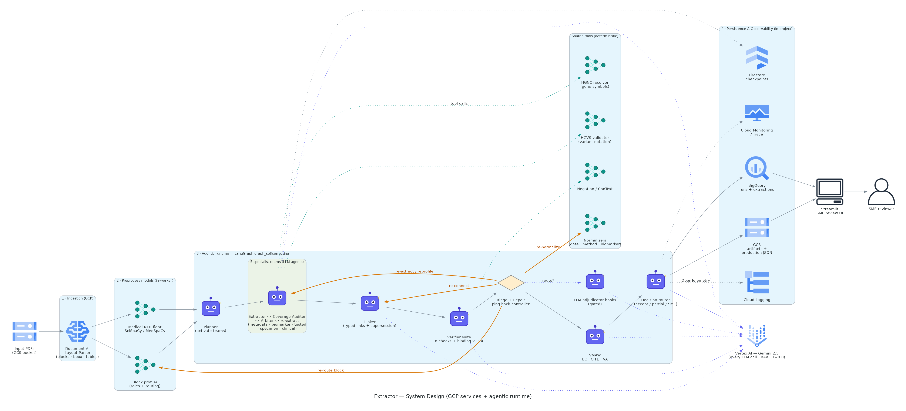
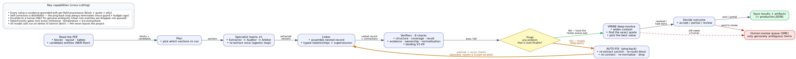
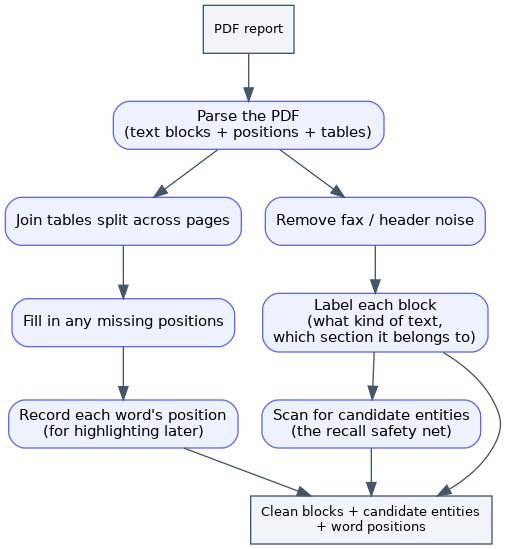
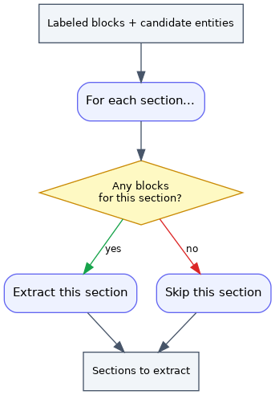
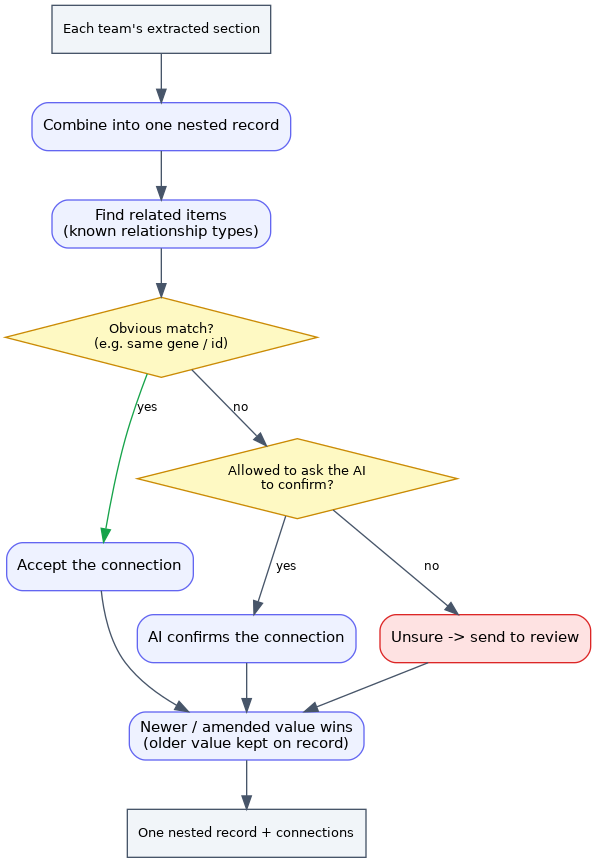
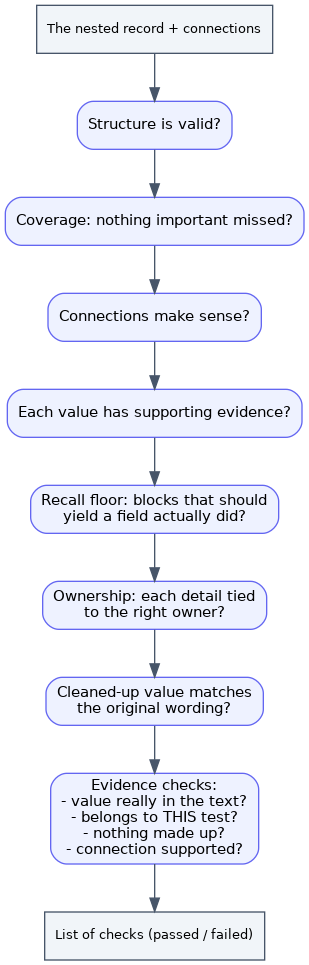
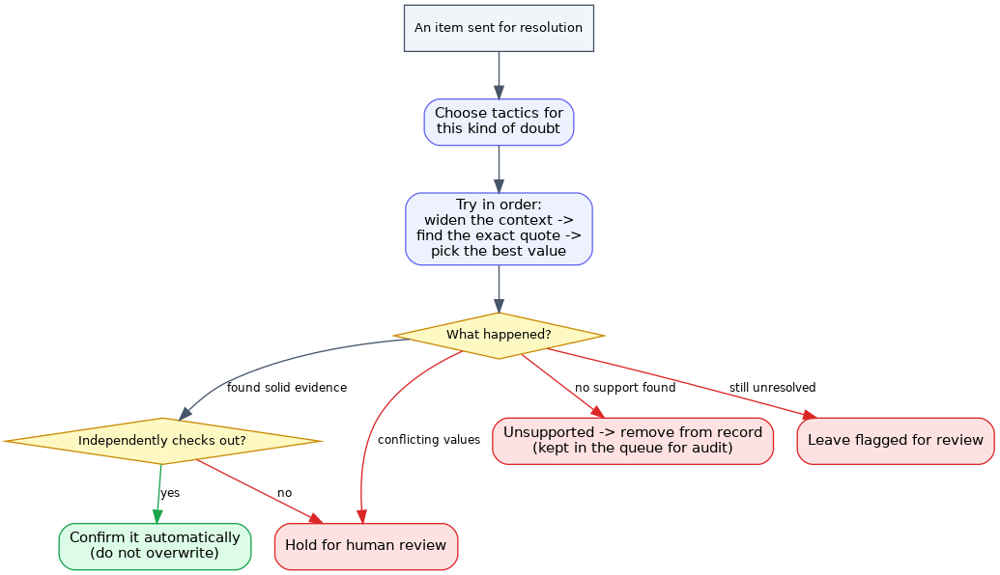
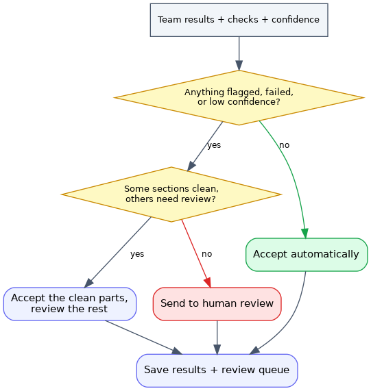

# Flowcharts — Overall Pipeline and Each Block

Rendered flowcharts (PNG) for the whole pipeline and each block. The two **loops** —
the in-team **agentic loop** and the **ping-back / repair loop** — have their own
condition-annotated diagrams in **[loops.md](loops.md)**.

> Images are generated from `scripts/gen_doc_diagrams.py` (Graphviz + the `diagrams`
> icon library). Re-run `PYTHONPATH=. python scripts/gen_doc_diagrams.py` after
> changing the flow.

---

## System design (deployment view)

The actual GCP services and where the agent runtime sits. All model calls go to Vertex
AI Gemini (BAA path); persistence and observability stay in-project; the Flask +
HTML/JS SPA (`ui/`) reads the saved artifacts for SME review.

This is the **infrastructure** view. The **logical pipeline** flow is below.

---

## Overall pipeline (graph_selfcorrecting)

The full self-correcting flow. The only branch is at **triage**: loop back through
`repair → linker` while defects are fixable (yellow), otherwise go to `vmaw` (green).

> graph_linear is the same minus `triage / repair / vmaw`. graph_v1 is metadata-only.
> Prose: [overview.md §1](overview.md#1-three-graphs-langgraph).

---

## Preprocess

PDF → the block layer everything downstream reads.

Prose: [components.md §2](components.md#2-preprocessing-preprocess).

---

## Planner

Picks which of the 5 teams to run, from document signals.

Prose: [overview.md §3](overview.md), [components.md §4](components.md#4-teams-teams).

---

## Linker

Assembles the nested envelope and forms typed cross-section relationships; deterministic
gene-key links are trusted, narrative links are LLM-confirmed or marked uncertain.

Prose: [overview.md §4](overview.md#4-linking).

---

## Verifier suite

Eight checks in order; each appends a scorecard, the binding verifier adds V1–V4.

Prose: [components.md §5](components.md#verifiers).

---

## VMAW

Deep-resolves each escalation before a human sees it; auto-applies only grounded
confirmations, holds contested picks, drops ungroundable no-support kinds.

Prose: [overview.md §7](overview.md#7-vmaw--deep-resolution-of-escalations).

---

## Decision router + persist

Prose: [overview.md §8](overview.md#8-decision--persist).
