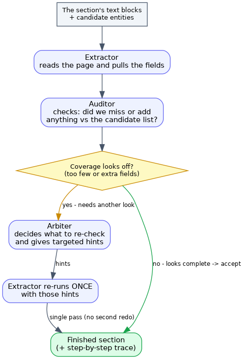
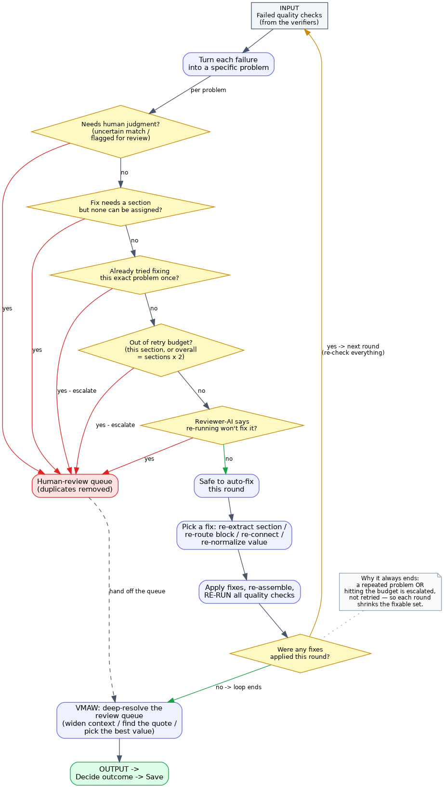

# The Two Loops — Agentic Loop & Ping-back / Repair Loop (with conditions)

The system has **two distinct loops**. This page documents both with their exact
branch conditions, drawn from the code. Other block flowcharts are in
[diagrams.md](diagrams.md).

- **Agentic loop** — *inside* a single team. A small, bounded extractor↔auditor↔arbiter
  exchange that self-corrects one section before it leaves the team.
- **Ping-back / repair loop** — *across* the graph. The whole
  `verifiers → triage → repair → linker → verifiers …` cycle that fixes defects after
  linking, under budget and recurrence guards, escalating what it cannot fix.

---

## 1. Agentic loop (in-team, per section)

Code: `teams/section_team.py` (skeleton), `agents/coverage_auditor.py`,
`agents/arbiter.py`, `agents/extractor.py`.

### Steps and conditions

1. **Extractor** runs a ReAct loop (reason → call tools → repeat) and emits a
   **Final-Answer JSON**, validated against the section's Pydantic model. (Optional
   flag-gated `json_schema` finalizer; default is free-text parse + Pydantic check.)
2. **Coverage Auditor** compares the extractor's output to the `parser_hypothesis`
   (the deterministic NER recall floor). It computes a coverage gap and lists specific
   missed / spurious fields.
3. **Branch — `gap_signal`?**
   - **No** (coverage within tolerance, nothing flagged) → the section output is
     **accepted** as-is. The Arbiter does *not* run. This is the common path.
   - **Yes** — raised when the coverage gap exceeds `coverage_gap_tolerance` (**0.10**,
     per `config/teams.yaml`) **or** the auditor singled out missed/spurious fields.
4. **Arbiter** (only on `gap_signal`) resolves the Extractor↔Auditor disagreement and
   emits **per-field re-extract hints** ("look in the ancillary studies row").
5. **Extractor (re-extract)** re-runs **exactly once** with those focused hints, then
   the section output is produced.

### Bounds

- The re-extract is a **single pass** — there is no unbounded in-team loop. If the
  result is still wrong, that surfaces later as a *defect* at the verifier stage and is
  handled by the ping-back loop (below), not by re-running the team again here.
- Every step is recorded into `agent_trace` (PHI-safe: counts, verdicts, short reasoning
  + per-field reasons) — this is the "extraction" phase of the UI field timeline.

---

## 2. Ping-back / repair loop (graph-level, the auto-fix)

Code: `pipeline/triage.py` (classify + decide), `pipeline/repair.py` (apply),
`pipeline/graph_selfcorrecting.py` (the `repair → linker` edge + the `triage` conditional edge).

### How a cycle runs

`verifiers` produce scorecards + binding verdicts → **triage `build_defects`** turns
them into typed defects → for **each defect**, triage walks the decision ladder below →
defects that can be fixed become `repair_requests`; the rest go to the **SME queue**.
If there is at least one repair request, `route = "repair"` (apply, then back to the
**linker**, then re-verify, then triage again). When nothing is addressable,
`route = "done"` → VMAW.

### The decision ladder (evaluated per defect, in order)

| # | Condition (if true → **escalate** to SME queue) | Source |
|---|---|---|
| 1 | `defect_type ∈ _ESCALATE_ONLY` = `{binding_uncertain, needs_review}` — needs human judgment | `triage._ESCALATE_ONLY` |
| 2 | action is `_TEAM_REQUIRED` (`re_extract_team`, `reprofile_block`) but triage cannot assign a target team | `triage._TEAM_REQUIRED` |
| 3 | the defect **signature** `(team\|ref\|type)` is already in `defect_signatures_seen` — **recur-guard** (it was repaired once and came back) | recur-guard |
| 4 | the **per-team repair cap** is reached for the owning team | per-team cap |
| 5 | the **global repair budget** is exhausted — global cap = `active_teams × 2` | global cap |
| 6 | (only if `LLM_ADJUDICATORS` on) the **triage router** judges the defect not re-extraction-fixable and returns `escalate` | `build_triage_llm` |

If **none** of the above fire, the defect is **repaired**: triage maps it to an action
via `_ADDRESSABLE` and emits a repair request.

### Defect → repair action (`_ADDRESSABLE`)

| Defect | Action | Pings back to | Note |
|---|---|---|---|
| `schema_error` | `re_extract_team` | the owning team's Extractor | needs a team |
| `recall_miss_present` | `re_extract_team` | Extractor | block-role recall miss |
| `block_misroute` | `reprofile_block` | Block profiler + Extractor | block had the role but routed to the wrong section |
| `missing_provenance` | `re_extract_team` | Extractor | value with no occurrences/citation |
| `binding_refuted` | `re_extract_team` | Extractor | ping back **once**; recur-guard escalates on repeat |
| `link_cannot_form` | `re_link` | the **Linker** (not the extractor) | a V4 cross-section refutation |
| `normalization_invalid` | `renormalize_field` | the normalizer hook | canonical ≠ verbatim |
| `attribution_contested` | `re_extract_team` | Extractor | re-extract once → recur → VMAW (cite/va) → SME |
| `binding_uncertain` | — | (escalate-only) | human judgment |
| `needs_review` | — | (escalate-only) | OCR/inference flag |

### What "ping-back" means per action

- **`re_extract_team` / `reprofile_block`** re-run the **owning team** (its agentic
  loop runs again) with the repair hint; `reprofile_block` first patches the block's
  `target_umbrella_hints` so the right team picks it up.
- **`re_link`** pings the **Linker** via the `repair → linker` edge with an
  *avoid / re-evaluate* hint — the extractor is **not** re-run.
- **`renormalize_field`** runs the normalizer hook on the field (writes canonical only
  when matched + different; verbatim always preserved).
- **`drop_and_flag`** removes an ungroundable record and queues it (payload kept for
  audit/restore).
- **`escalate`** sends the defect straight to the SME queue.

### Termination (why it always stops)

- **Recur-guard**: any defect signature that reappears after a repair is escalated, not
  repaired again — so the same defect cannot bounce forever.
- **Budget caps**: per-team cap and a global cap of `active_teams × 2` repair cycles;
  once hit, remaining defects escalate.
- **Queue dedup**: the SME queue is deduplicated by `(kind, ref, section, detail)` so a
  standing defect re-detected across cycles is not double-counted.
- **Recursion backstop**: `GRAPH_RECURSION_LIMIT` guarantees the LangGraph loop ends
  even if the budget logic were misconfigured.

When triage finds no addressable defect, `route = "done"` and control moves to **VMAW**
(see [diagrams.md](diagrams.md#vmaw) and [overview.md §7](overview.md#7-vmaw--deep-resolution-of-escalations)),
which gets one more grounded attempt at the queued items before any human review.
